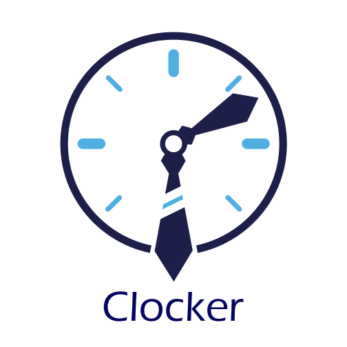
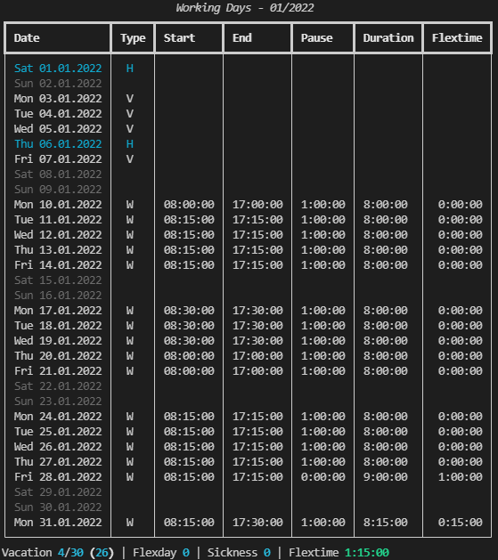

# Clocker - Working Time Tracker

[](https://www.python.org/)
[](https://github.com/Brokdar/Clocker/blob/main/LICENSE)



## Description

Clocker is a console application for keeping track of your working time. The working time is stored in a local file-based database (JSON). With simple commands, you're able to start and stop the time tracking for the current day or generate/modify existing records.



As shown in the image, Clocker does support different day types (**W**: workday, **V**: vacation, **H**: public holidays, **S**: sick). The public holidays can be automatically added with `holidays` command and will be displayed in cyan.

With the configuration file `settings.ini` it is possible to specify default values like working hours per day, default pause time, or certain behavioral features like the rounding to quarter hours while tracking the time.

## Features

- Easy to use and automate
- Overview of your vacation, flex and sick days
- Automatically add public holidays
- Compact and clear monthly view
- Configurable default values and behaviors
- PDF report generation

## Limitations

- Display is specified in german date & time format
- Public holidays are taken from Germany, Baden-Württemberg

## Usage

### Command Overview

```text
Usage: python -m clocker [OPTIONS] COMMAND [ARGS]...

Options:
  -d, --debug  Sets logging level to debug
  --help       Show this message and exit.

Commands:
  holidays  Updates public holidays of a given year
  notify    Notifies about an absence day
  remove    Remove a workday from database
  show      Displays all tracked workdays of the given month and year
  start     Starts the time tracking for the current day
  stop      Stops the time tracking for the current day
  track     Manual tracking of workdays, can be used to update values
```

### Detailed Commands

#### Command - start

```text
Usage: python -m clocker start [OPTIONS]

  Starts the time tracking for the current day

Options:
  --help  Show this message and exit.
```

#### Command - stop

```text
Usage: python -m clocker stop [OPTIONS]

  Stops the time tracking for the current day

Options:
  --help  Show this message and exit.
```

#### Command - track

```text
Usage: python -m clocker track [OPTIONS]

  Manual tracking of workdays, can be used to update values

Options:
  -d, --date TEXT   Date of workday in format: dd.mm.yyyy  [required]
  -b, --begin TEXT  Start time of workday in format: hh:mm[:ss]
  -e, --end TEXT    End time of workday in format: hh:mm[:ss]
  -p, --pause TEXT  Pause time on workday in format: hh:mm[:ss]
  --help            Show this message and exit.
```

#### Command - notify

```text
Usage: python -m clocker notify [OPTIONS]

  Notifies about an absence day

Options:
  -d, --date TEXT     Date of workday in format: dd.mm.yyyy  [required]
  -a, --absence TEXT  Absence type: W=Workday, V=Vacation, F=Flexday,
                      S=Sickness, H=Holiday  [required]
  --help              Show this message and exit.
```

#### Command - show

```text
Usage: python -m clocker show [OPTIONS]

  Displays all tracked workdays of the given month and year

Options:
  -m, --month INTEGER  Month to show, defaults to current month
  -y, --year INTEGER   Year to show, defaults to current year
  --help               Show this message and exit.
```

#### Command - report

```text
Usage: python -m clocker report [OPTIONS]

  Generates a PDF report for the given month and year

Options:
  -m, --month INTEGER  Month to show, defaults to current month
  -y, --year INTEGER   Year to show, defaults to current year
  --help               Show this message and exit.
```

## Automate tracking on Windows

The idea behind the automation is to run the `start` command whenever you start working (startup/logon) and the `stop` command when you stop working (shutdown, logoff). With that setup `Clocker` will automatically track your working hours without the need of taking any action.

### Create custom console command

Create a file with the following name: `clocker.cmd` and content:

```batch
python -m clocker %*
```

In order to let the console recognize the custom command, the path to file must be added to the path environment variable of Windows.

### Run commands based on Windows Events

There're multiple ways to run scripts based on certain Windows Events. Two commonly used ones are:

- [Task Scheduler](https://en.wikipedia.org/wiki/Windows_Task_Scheduler): launches scripts at pre-defined times or after specified time intervals
- [Group Policies](https://docs.microsoft.com/en-us/previous-versions/windows/it-pro/windows-server-2012-r2-and-2012/dn789196(v=ws.11)#:~:text=computer%20shutdown%20scripts-,To%20assign%20computer%20shutdown%20scripts,Scripts%20(Startup%2FShutdown).): add startup, shutdown, logon, and logoff scripts
